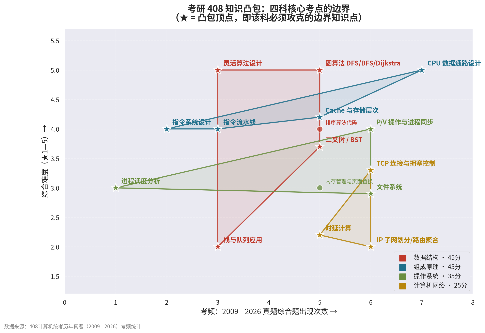

# 408 知识凸包 · 考研计算机学科专业基础综合

> 把 408 四门课的知识点画进一张"考频 × 难度"坐标图，
> 对每科求**凸包**——凸包顶点就是框住全科考点边界的核心知识点。
> 守住顶点，就守住了整张地图。



## 什么是"知识凸包"

- **横轴 = 考频**：该考点在 2009—2026 年真题**综合题**中出现的次数；
- **纵轴 = 综合难度**：★1—5，来自历年真题难度评级；
- 对每科的所有核心考点求凸包，**凸包顶点 = 该科的边界核心**：
  - 右上顶点：高频 + 高难 → 决定你能不能上 130；
  - 右下顶点：高频 + 低难 → 必须满分的"性价比之王"；
  - 左上顶点：低频 + 高难 → 区分度的来源，冲高分的胜负手；
  - 左下顶点：低频 + 低难 → 花最少时间封住的地板。
- 凸包**内部**的点（如排序算法代码、内存管理）同样必考——
  顶点负责"划定边界"，内部点靠顶点之间的连线知识覆盖。

## 凸包顶点精讲（14 篇）

### 🔴 数据结构 DS（45 分）

| 顶点 | 考频 | 难度 | 笔记 |
|------|------|------|------|
| 栈与队列应用 | 3 | ★★ | [DS-01](notes/DS-01-栈与队列应用.md) |
| 二叉树 / BST | 5 | ★★★★ | [DS-02](notes/DS-02-二叉树与BST.md) |
| 图算法 DFS/BFS/Dijkstra | 5 | ★★★★★ | [DS-03](notes/DS-03-图算法.md) |
| 灵活算法设计（新趋势） | 3 | ★★★★★ | [DS-04](notes/DS-04-灵活算法设计.md) |

### 🔵 计算机组成原理 CO（45 分）

| 顶点 | 考频 | 难度 | 笔记 |
|------|------|------|------|
| 指令系统设计 | 2 | ★★★★ | [CO-01](notes/CO-01-指令系统设计.md) |
| 指令流水线 | 3 | ★★★★ | [CO-02](notes/CO-02-指令流水线.md) |
| Cache 与存储层次 | 5 | ★★★★ | [CO-03](notes/CO-03-Cache与存储层次.md) |
| **CPU 数据通路设计** | **7** | ★★★★★ | [CO-04](notes/CO-04-CPU数据通路设计.md) |

### 🟢 操作系统 OS（35 分）

| 顶点 | 考频 | 难度 | 笔记 |
|------|------|------|------|
| 进程调度分析（2026 新题） | 1 | ★★★ | [OS-01](notes/OS-01-进程调度分析.md) |
| 文件系统 | 6 | ★★★ | [OS-02](notes/OS-02-文件系统.md) |
| P/V 操作与进程同步 | 6 | ★★★★ | [OS-03](notes/OS-03-PV操作与进程同步.md) |

### 🟡 计算机网络 CN（25 分）

| 顶点 | 考频 | 难度 | 笔记 |
|------|------|------|------|
| 时延计算 | 5 | ★★ | [CN-01](notes/CN-01-时延计算.md) |
| IP 子网划分/路由聚合 | 6 | ★★ | [CN-02](notes/CN-02-IP子网划分与路由聚合.md) |
| TCP 连接与拥塞控制 | 6 | ★★★ | [CN-03](notes/CN-03-TCP连接与拥塞控制.md) |

## 数据依据

凸包坐标全部来自 2009—2026 真题统计，原始数据见 [data/](data/)：

- [历年考题分析汇总（2009-2026）](data/历年考题分析汇总（2009-2026）.md)
- [数据结构真题整理](data/数据结构真题整理.md)
- [计算机组成原理真题整理](data/计算机组成原理真题整理.md)
- [操作系统真题整理](data/操作系统真题整理.md)
- [计算机网络真题整理](data/计算机网络真题整理.md)

## 复现凸包图

```bash
python hull/convex_hull.py   # 依赖 matplotlib + numpy，输出 hull/408知识凸包.png
```

## 使用顺序建议

```
1. 先看凸包图：知道边界在哪里
2. 从右下顶点开始（性价比高）：CN-02 → CN-01 → OS-02 → DS-01
3. 攻右上顶点（决定上限）：CO-04 → DS-03 → OS-03 → CN-03
4. 补左上顶点（冲 130+）：DS-04 → CO-01 → CO-02
5. 每篇笔记末尾的"真题锚点"链接到 data/ 中对应年份精做
```

---

*基于 2009—2026 年 408 统考真题考频统计构建 · 2026 年 8 月*
